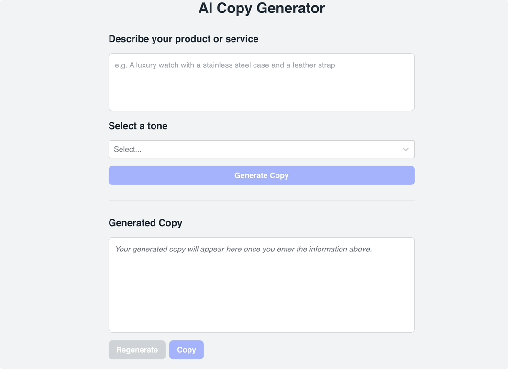

# AI Copy Generator

A simple AI copy generator built with Next.js, OpenAI, and Tailwind CSS. The main theme with this project was to keep things simple; this includes the implementation and the user experience. **This was all done in an effort to get comfortable working with AI and building an actual product with it.**

Here's a link to the [deployment](https://google.com), in case you'd like to generate some cool marketing messages yourself. :)

Here's a link to a [loom](https://www.loom.com/share/67b09d813cb34c989a12ac0fd6b70cbc?sid=7546c7b6-e3df-429c-8e55-d5ddacf9fd8e) that I recorded to provide some color on the app and the technical approach taken.

## Features

- Generate copy for your business with AI
- Select a tone for the copy
- Copy the generated copy to your clipboard
- Regenerate the copy with a single click, if you're not happy with it

## Screenshots

